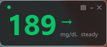
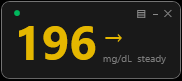
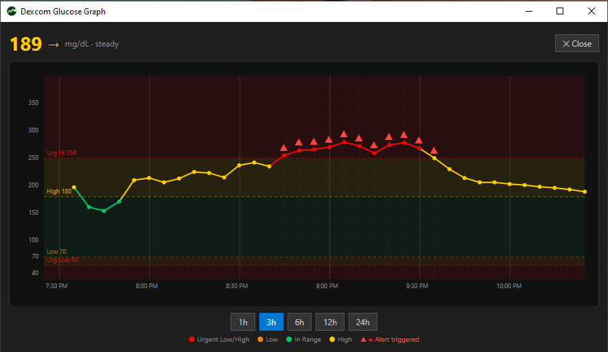
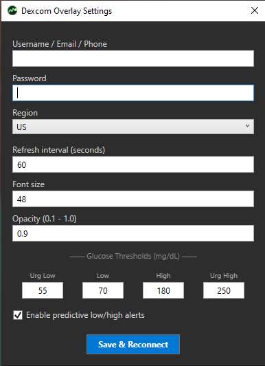

# Dexcom Overlay

A lightweight, always-on-top Windows desktop overlay that displays your real-time Dexcom CGM glucose reading. Built with C# / WPF and the Dexcom Share API.



## Features

### Real-Time Glucose Overlay
- **Always-on-top** borderless widget showing your current glucose value
- **Color-coded** by threshold: green (in range), yellow (high), orange (low), red (urgent)
- **Trend arrows** showing glucose direction (↑↑ ↑ ↗ → ↘ ↓ ↓↓)
- **Draggable** — place it anywhere on screen; position is remembered between sessions
- **Minimal footprint** — sits unobtrusively on your desktop



### Interactive Graph View
- **Full glucose timeline graph** with color-coded data points and connecting lines
- **Adjustable time windows**: 1h, 3h, 6h, 12h, 24h
- **Threshold zone overlays** showing your configured ranges
- **Alert markers** (▲) indicating where alerts would have triggered
- **Hover tooltips** with exact value, time, and trend for each data point
- **Resizable window** — graph redraws dynamically



### Predictive Alerts
- **Windows toast notifications** for predicted lows and highs
- Alerts when glucose is trending toward your thresholds
- Urgent alerts for values already outside safe range
- **Configurable cooldown** to prevent notification spam (default: 15 min)

### Settings
- Dexcom Share credentials (username, password, region)
- Refresh interval, font size, opacity
- Glucose thresholds (urgent low, low, high, urgent high)
- Toggle mmol/L or mg/dL
- Enable/disable predictive alerts



## Download

Download the latest `DexcomOverlay.exe` from the [Releases](../../releases/latest) page.

It's a **self-contained single-file exe** — no .NET installation required. Just download and run.

## Requirements

- **Windows 10** (build 19041) or later
- A **Dexcom Share** account with an active CGM session
  - Dexcom G6, G7, or ONE connected to the Dexcom mobile app with Share enabled
- Internet connection

## Getting Started

1. **Download** `DexcomOverlay.exe` from [Releases](../../releases/latest)
2. **Run** the exe — a small dark overlay appears in the top-right of your screen
3. **Right-click** the overlay → **Settings**
4. Enter your **Dexcom Share credentials** (same as your Dexcom mobile app login)
5. Select your **region** (US, Outside US, or Japan)
6. Click **Save & Reconnect**

Your glucose reading will appear within a few seconds.

### Controls

| Action | How |
|--------|-----|
| Move the overlay | Click and drag |
| Open settings | Right-click → Settings |
| Open graph | Click the **▤** icon (top-right) or right-click → Graph |
| Minimize to taskbar | Click the **─** icon or right-click → Minimize |
| Refresh now | Right-click → Refresh Now |
| Switch mg/dL ↔ mmol/L | Right-click → Toggle mmol/L |
| Logout / clear credentials | Right-click → Logout / Clear Credentials |
| Close | Click **✕** or right-click → Exit |

## Configuration

Settings are stored in `%AppData%\DexcomOverlay\config.json` and persist across restarts.

### Default Thresholds

| Threshold | Default (mg/dL) |
|-----------|----------------|
| Urgent Low | 55 |
| Low | 70 |
| High | 180 |
| Urgent High | 250 |

## Building from Source

### Prerequisites
- [.NET 8 SDK](https://dotnet.microsoft.com/download/dotnet/8.0) (Windows)

### Build
```bash
dotnet build DexcomOverlay/DexcomOverlay.csproj -c Release
```

### Run
```bash
dotnet run --project DexcomOverlay/DexcomOverlay.csproj
```

### Publish (self-contained single exe)
```bash
dotnet publish DexcomOverlay/DexcomOverlay.csproj -c Release -r win-x64 --self-contained true -p:PublishSingleFile=true -p:IncludeNativeLibrariesForSelfExtract=true -p:EnableCompressionInSingleFile=true -o publish
```

## Auto-Start with Windows

To have the overlay start automatically when you log in:

1. Press `Win + R`, type `shell:startup`, press Enter
2. Create a shortcut to `DexcomOverlay.exe` in that folder

## How It Works

This app uses the **Dexcom Share API** (the same API the Dexcom Follow app uses) to fetch your glucose readings. It does **not** use the official Dexcom Developer API, so there's no need for OAuth2 or developer account registration.

### API Details
- Authenticates with your Dexcom Share/Follow credentials
- Fetches the latest glucose reading every 60 seconds (configurable)
- Caches 24 hours of data to minimize API calls (2-minute TTL)
- Supports US, Outside-US, and Japan Dexcom servers

## Privacy & Security

- Your credentials are stored **locally** in `%AppData%\DexcomOverlay\config.json`
- Username and password are **encrypted at rest** using [Windows DPAPI](https://learn.microsoft.com/en-us/dotnet/standard/security/how-to-use-data-protection) (tied to your Windows user account)
- If you have an existing plain-text config, it will be **automatically encrypted** on the next save
- No data is sent anywhere except to Dexcom's servers
- No analytics, telemetry, or third-party services

## Disclaimer

This project is **not affiliated with, endorsed by, or connected to Dexcom, Inc.** in any way. It is an independent open-source project that uses the Dexcom Share API.

This software is provided for informational purposes only and should **not** be used as a substitute for professional medical advice. Always consult your healthcare provider for medical decisions. Do not rely solely on this app for glucose monitoring — always use your Dexcom receiver or mobile app as your primary monitoring device.

## License

[MIT](LICENSE)
